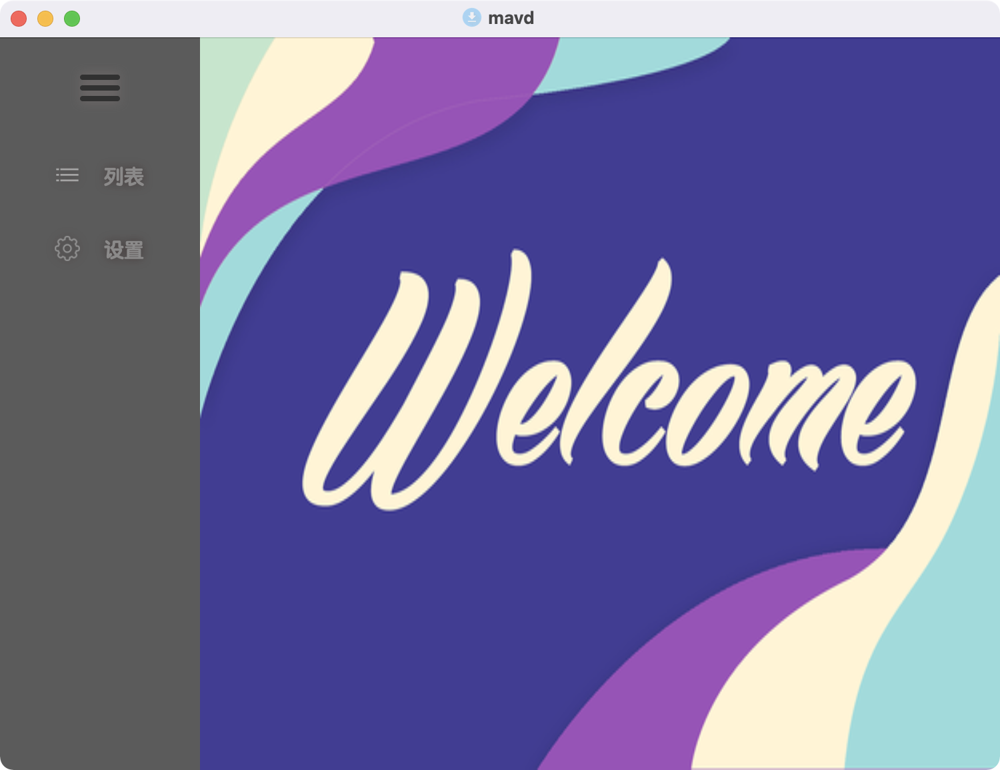
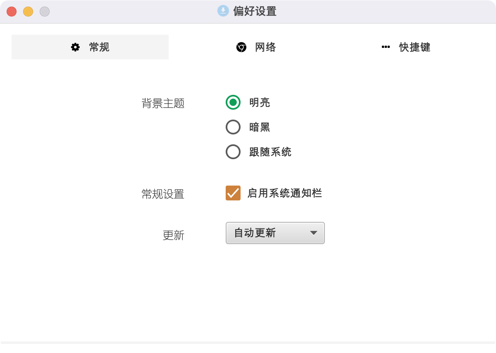
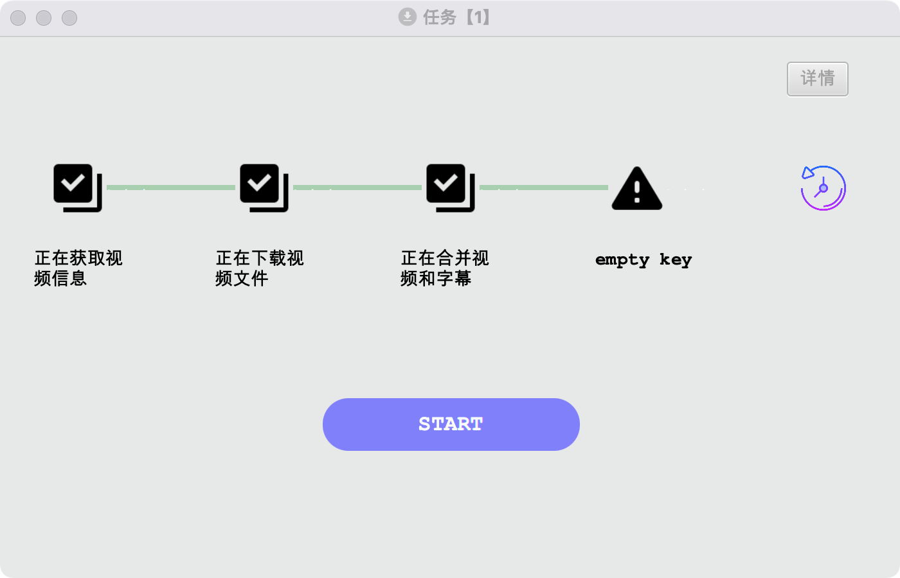

### 什么是MAVD？
> MAVD 是 Monkey App Video Download 的首字母简写形式，MAVD是一款开放源代码、免费软件，集成了视频采集，上载到云对象存储，并发布到Wordpress的自动化视频采集桌面应用程序。

- [官网](https://monkeyapp.cn)
- [gitee](https://gitee.com/corbettzhang/MAVD)
- [github](https://github.com/corbettzhang/MAVD)

### 感谢
MAVD依赖以下库
* jfoenix
* controlsfx
* fontawesomefx
* jnativehook
* ffmpeg
* youtube-dl
* webp-io

### 应用截图

{:height="50%" width="50%"}

{:height="50%" width="50%"}

{:height="50%" width="50%"}

{:height="50%" width="50%"}